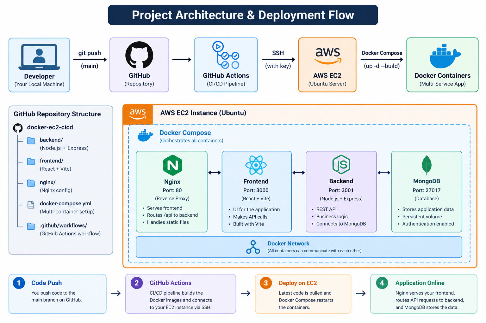
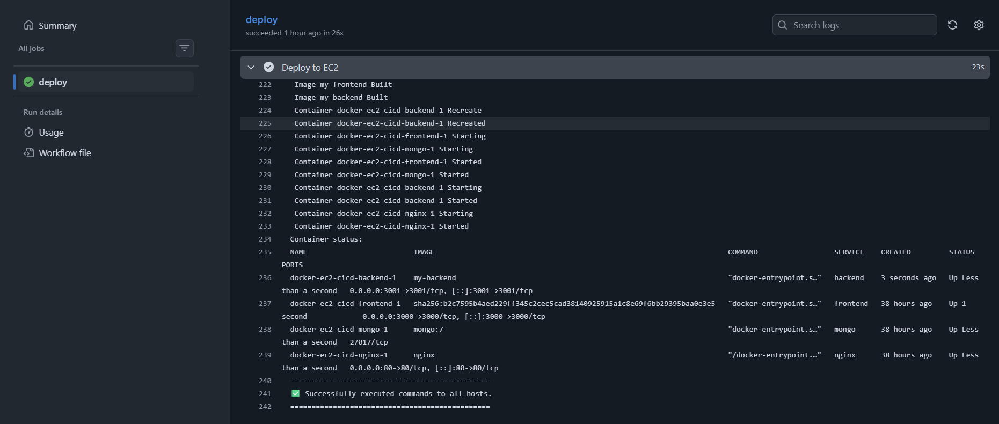
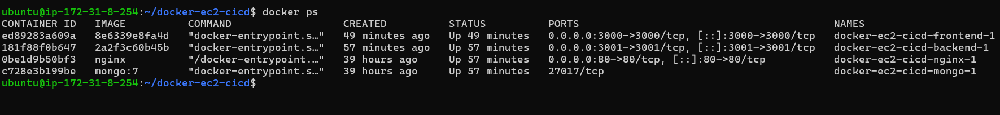

# Dockerized Full-Stack Application with AWS EC2 & CI/CD

A full-stack Todo application containerized with **Docker Compose**, deployed on **AWS EC2**, and automatically deployed using **GitHub Actions CI/CD**.

## Architecture

```text
Developer
    │
    │ git push
    ▼
GitHub
    │
    ▼
GitHub Actions
    │ SSH
    ▼
AWS EC2
    │
    ▼
Docker Compose
    │
    ├── Nginx
    ├── React Frontend
    ├── Node.js Backend
    └── MongoDB
```

Nginx acts as the reverse proxy and routes:

```text
/      → Frontend
/api/  → Backend
```

## Tech Stack

* **Frontend:** React
* **Backend:** Node.js
* **Database:** MongoDB
* **Containerization:** Docker, Docker Compose
* **Reverse Proxy:** Nginx
* **Cloud:** AWS EC2
* **CI/CD:** GitHub Actions
* **Server:** Ubuntu Linux
* **Version Control:** Git
* **Authentication:** SSH

## Project Structure

```text
docker-ec2-cicd/
│
├── .github/
│   └── workflows/
│       └── deploy.yml
│
├── backend/
│   ├── Dockerfile
│   ├── models/
│   ├── routes/
│   └── server.js
│
├── frontend/
│   ├── Dockerfile
│   ├── public/
│   └── src/
│
├── nginx/
│   └── nginx.conf
│
├── docker-compose.yml
└── README.md
```

## CI/CD Pipeline

A push to the `main` branch triggers the GitHub Actions deployment:

```text
git push
   ↓
GitHub Actions
   ↓
SSH into EC2
   ↓
Fetch latest code
   ↓
Docker Compose build
   ↓
Restart containers
   ↓
Application updated
```

The EC2 server automatically receives the latest version without manually rebuilding the application.

## Running Locally

### Clone the repository

```bash
git clone https://github.com/SukhiBhatti/docker-ec2-cicd.git
cd docker-ec2-cicd
```

### Start the application

```bash
docker compose up -d --build
```

### Check containers

```bash
docker compose ps
```

Open:

```text
http://localhost
```

## Deployment

The application is deployed on an **AWS EC2 Ubuntu server** and exposed through the EC2 public IP.

```text
http://<EC2-PUBLIC-IP>
```

## Key DevOps Concepts Demonstrated

* Docker image and container management
* Docker Compose multi-service architecture
* Docker networking
* Docker volumes and database persistence
* Nginx reverse proxy
* AWS EC2 deployment
* Linux server administration
* SSH authentication
* GitHub Actions CI/CD
* Deployment troubleshooting

## 📸 Screenshots

### Architecture


### CI/CD Pipeline


### Running Containers


## Author

**Sukhdeep Singh**

GitHub: [SukhiBhatti](https://github.com/SukhiBhatti)
